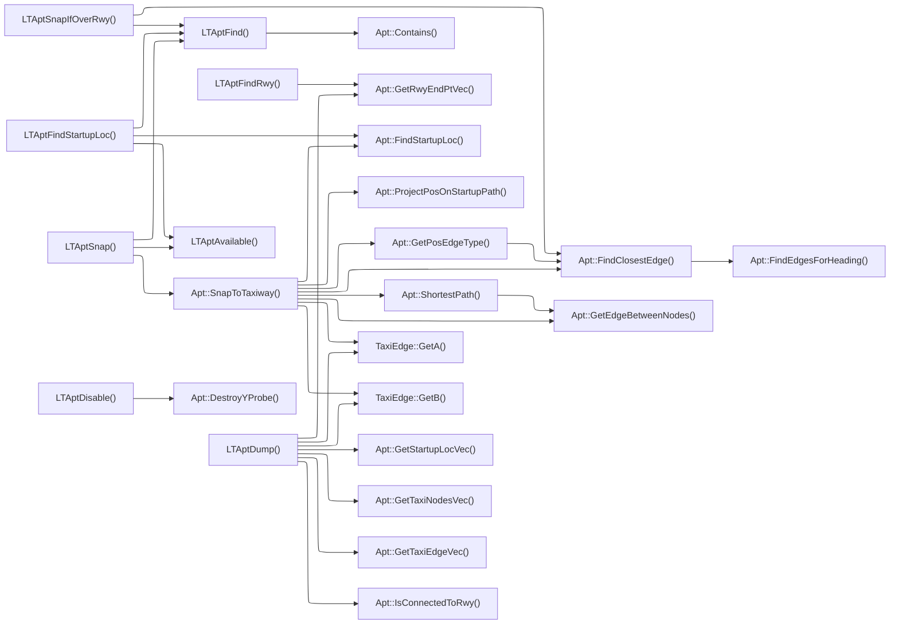
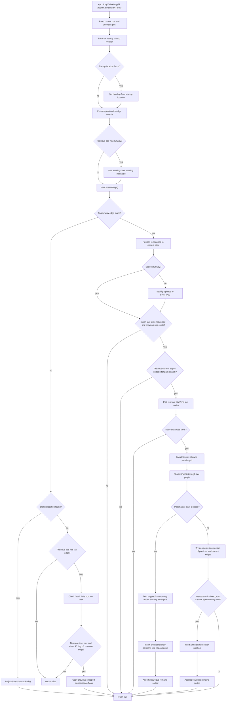

# LTApt.cpp

## Call Hierarchy

### LTApt::SnapToTaxiway()

The function first tries to snap the current aircraft position to a startup location or the closest taxi/runway edge. If that fails, it has a fallback for a specific near-edge drift case based on the previous snapped position. If snapping succeeds and taxi-turn insertion is enabled, it tries to insert intermediate positions along the airport taxi graph using `ShortestPath()`; if no graph path works, it falls back to inserting a geometric edge-intersection point when that looks plausible.

